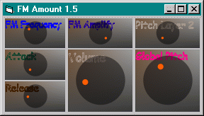



## FM Synth2 update 3

### Description

A real-time keyboard-driven FM software synthesizer with amplitude envelope, adjustable polyphony, and unique sound!
 
### More Info
 

             |
---                |---
**Submitted On**   |2003-07-15 00:33:58
**By**             |[dafhi](https://github.com/Planet-Source-Code/PSCIndex/blob/master/ByAuthor/dafhi.md)
**Level**          |Advanced
**User Rating**    |5.0 (35 globes from 7 users)
**Compatibility**  |VB 6\.0
**Category**       |[DirectX](https://github.com/Planet-Source-Code/PSCIndex/blob/master/ByCategory/directx__1-44.md)
**World**          |[Visual Basic](https://github.com/Planet-Source-Code/PSCIndex/blob/master/ByWorld/visual-basic.md)
**Archive File**   |[FM\_Synth2\_1614687152003\.zip](https://github.com/Planet-Source-Code/dafhi-fm-synth2-update-3__1-46897/archive/master.zip)

